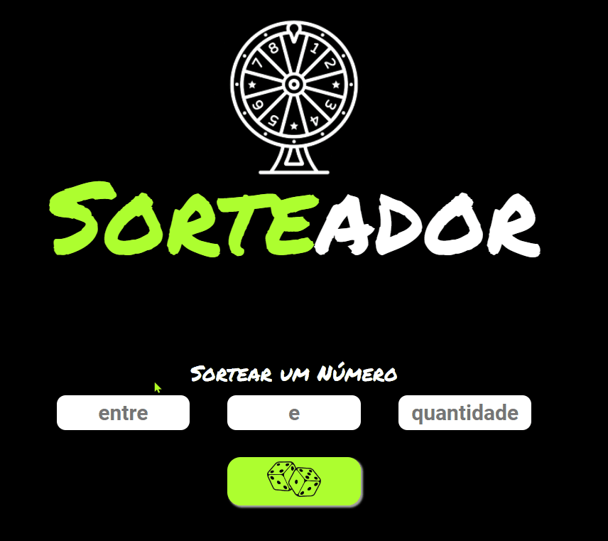

# "SORTEADOR"

## É o seu novo gerador de números aleatórios.

Faça sorteios de números aleatórios com este gerador super simples e funcional.

Adicione um intervalo de números e quantas vezes o intervalo escolhido será sorteado.

Eles nunca se repetem! Somente números únicos em seu sorteio!

 

# "SORTEADOR"

## Is your new random number drawer.

Draw random numbers with this super simple and functional generator.

Add a range of numbers and how many times the chosen range will be drawn.

They never repeat! Only unique numbers in your draw!

You can view the project via the link:  
https://srbaliardo.github.io/random-numbers-gen

 

"  |
 |
 "
